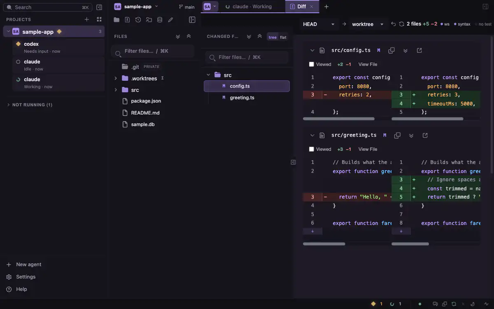

# code-viewer

A local, browser-based viewer for your repository's code and git diffs, with a
place to run and watch AI coding agents (claude, codex) in tmux.

English | [日本語](README_ja.md)



- Read files, diffs, commit history, blame and every worktree of a repository.
- Start claude or codex in tmux, see which ones need input, and answer them in a terminal tab.
- Keep several claude / codex accounts and see their usage.
- Browse SQLite, PostgreSQL, MySQL, Redis, Elasticsearch, DynamoDB, S3-compatible storage and Cloudflare D1.
- Let AI agents use it through a CLI, an MCP server and bundled skills.

One code-viewer serves every project from one port. It listens on `127.0.0.1` only.

## Contents

- [Requirements](#requirements)
- [Quick start](#quick-start)
- [Running it](#running-it)
- [Features](#features)
- [Datastore viewer](#datastore-viewer)
- [CLI for AI agents](#cli-for-ai-agents)
- [MCP server](#mcp-server)
- [Bundled agent skills](#bundled-agent-skills)
- [Files code-viewer writes](#files-code-viewer-writes)
- [Connect from outside](#connect-from-outside)
- [Development](#development)
- [License](#license)

## Requirements

| What | Needed for |
|---|---|
| Node.js 22.14 or newer, git | Everything |
| [tmux](https://github.com/tmux/tmux) | Agents, account sign-in and tmux panes (shells work without it) |
| claude and / or codex CLI | Running agents |
| `better-sqlite3` (optional dependency, installed with the package) | SQLite viewer, snapshots and `code-viewer query` |
| `@lydell/node-pty` (optional dependency, installed with the package) | Terminal tabs (shells, and agents opened in a tab) |
| Chrome | Installing it as an app (optional) |

## Quick start

1. In a git repository, run:

   ```sh
   npx @youtyan/code-viewer --open
   ```

   It prints `http://127.0.0.1:<port>/p/<key>/` and opens it. The repository is listed under **Projects** in the left sidebar.
2. Add more repositories with the **+** next to **Projects**, or run `npx @youtyan/code-viewer` in their folders.
3. Install tmux (`brew install tmux`, or your package manager on Linux).
4. **Settings → Accounts**: select **Sign in** on the claude or codex row.
5. (Recommended) **Settings → Agents → Agent integration**: select **Set up** to install hooks, so agent states are reliable.
6. **New agent** at the bottom of the sidebar: choose claude or codex, the account and the project, then **Launch**.
7. (Optional) **Enable notifications** on the **All agents** screen (`g a`).
8. (Optional) Give your AI the bundled skills: `npx @youtyan/code-viewer skill install`.

If something does not work, run `npx @youtyan/code-viewer doctor`. The in-app **Help** (bottom of the left sidebar) covers each step with screenshots.

## Running it

```sh
npx @youtyan/code-viewer                  # run without installing
pnpm dlx @youtyan/code-viewer             # same, with pnpm
npm install -g @youtyan/code-viewer       # or install it
code-viewer
```

- Running `code-viewer` again in another repository adds it to the running code-viewer and prints its URL. It does not start a second server.
- If a code-viewer of another version is running, it says where and does not start. Stop the old one with Ctrl+C.
- If you update or reinstall code-viewer while it runs, it can no longer start projects. Stop it (Ctrl+C) and run it again.
- The Diff screen compares `HEAD` with the working tree. Pick another range with the from / to pickers above the diff.

### Options

| Option | Meaning |
|---|---|
| `--cwd <dir>` | Repository to open (default: current directory) |
| `--open` | Open the URL in the default browser |
| `--port <port>` | Port to listen on (default: a free port) |
| `--idle-stop <seconds>` | Stop a project's process after this long unused (default `600`, `0` = never). Terminals and agents keep running |
| `--remote-access <file>` | Use this remote access file and open its listener on start (Settings → **Remote access** does the same without it; [Connect from outside](#connect-from-outside)) |
| `--standalone` | Run a separate server for this repository only |
| `--bin <name>=<absolute-path>` | Path of `git`, `rg`, `docker`, `gh` or `tmux`, for the repository you start in |
| `--scope-omit-dir <name>` | Directories not to read in the repository you start in (repeatable; replaces the default list and the one in Settings) |
| `--version`, `-v` / `--help`, `-h` | Version / full help |

- `CODE_VIEWER_BIN_GIT`, `CODE_VIEWER_BIN_RG`, `CODE_VIEWER_BIN_DOCKER`, `CODE_VIEWER_BIN_GH` and `CODE_VIEWER_BIN_TMUX` set the same paths for every project. Paths must be absolute executable files outside the opened repository.
- When a code-viewer is already running, `--port`, `--idle-stop`, `--bin` and `--scope-omit-dir` are not applied to it (it prints a warning); `--remote-access` stops with an error.
- `--remote-access` and `--idle-stop` cannot be combined with `--standalone`.

### SQLite

`better-sqlite3` comes with prebuilt binaries for macOS, Linux and Windows (x64 and arm64), so nothing is built when it is installed. Without it, the SQLite viewer, snapshots and every `code-viewer query` command fail; the rest works. `code-viewer doctor` shows whether the driver loads.

- `pnpm dlx` prints "Ignored build scripts: better-sqlite3". The prebuilt binary is used, so you can ignore it.
- On other platforms, run `npm run build-release` in the installed `better-sqlite3` folder (needs Python and a C++ compiler). `code-viewer doctor` shows the folder.

## Features

### Screen layout

| Area | What it holds |
|---|---|
| Left sidebar | Search, projects and their agents, **New agent**, **Settings**, **Help** |
| List column | The current project and branch, six screen icons, the file list, and the list of the current screen (changed files, commits, worktrees) |
| Tab row | Open files and screens, grouped by project |
| Main area | The front tab. Can be split into two sides |
| Bottom bar | Agents waiting / working, account usage, annotations, Copy AI context, auto update, theme, repository web page, Environment doctor |

- Screens: **Files** (`g r`), **Diff** (`g d`), **History** (`g h`), **Worktrees**, **Data** (`g b`), **Work log** (`g j`).
- Diff, History, Worktrees, Data and Work log each get one tab per project. Files is not a tab: the folder view shows when no tab is selected.
- A file opened with one click gets a temporary tab (italic name) that the next file replaces. Double-click or **Keep open** keeps it. Middle-click or ⌘/Ctrl+click opens a kept tab.
- A file at another revision opens in its own tab, named like `a.ts @ 1a2b3c4`.
- Tab groups: a colored label per project. Select it to collapse the group; its ▾ has **New shell**, **New agent…**, that project's screens and **Close this group**.
- Right-click a tab: **Close**, **Close others**, **Close to the right**, **Copy path**, **Split right**, **Move to other side** and more. Drag to reorder.
- Split: the split button at the right of the tab row, **Split right**, or drag a tab to the right half. Screens stay on the left; files, terminals and images can go on either side. `g o` moves the focus to the other side.
- Columns fold by hand, and fold by themselves when the window is narrow.
- Tabs are shared by all projects and by every window.
- Back / Forward return to the scroll position.

### Files

- **Code**, **Preview**, **Blame** and **History** tabs above each file.
- Preview: Markdown, HTML, CSV / TSV, images, video, audio and PDF.
- Markdown: table of contents, task lists, Mermaid diagrams (click to enlarge), Shiki highlighting. Relative links lead where they do on GitHub.
- CSV / TSV: a table with search, per-column filters and sorting.
- Large files open in a lighter, virtualized view (copy the whole file, or open the full view).
- Drag over line numbers to select lines, then **Copy AI reference** copies `@path#start-end` (Shift: with the code). **Line history** shows the commits that changed those lines (`git log -L`).
- On GitHub remotes: **Open on GitHub** for the repository or a file, and **Open selected lines on GitHub** for the selected lines.
- ⌘/Ctrl+click or `g .` on a name jumps to its definition.
- File list filter: plain text, `/regex/`, `~fuzzy`, or globs such as `*.ts` and `src/**`.
- Folder listings show **Last committed** and **Local modified**, each sortable.
- Symbolic links show `→ target` and open their target.
- Open a folder in the OS file manager, create folders, move files to the Trash (⌘/Ctrl+Z undoes it), and upload files into worktree folders (**Settings → Files → Uploads**).
- File changes reload live in every open tab.
- Build, dependency and tool folders (`node_modules`, `dist`, `vendor`, `bin`, `log`, `tmp`, `.venv`, …) are listed but not read or searched. Change the list in **Settings → Files**.
- On Linux the number of watched folders is capped (**Settings → Advanced → File change watcher**); a banner shows when the cap is reached.

Marks in the file list:

| Mark | Meaning |
|---|---|
| `M` | Modified |
| `A` | Added (staged) |
| `D` | Deleted |
| `R` | Renamed |
| `C` | Conflicted (merge conflict) |
| `U` | Untracked (never `git add`ed) |
| `I` | Ignored by `.gitignore` |

### Diffs

- Unified or split layout, ignore whitespace (on by default), hide test files.
- **Viewed** checkbox per file.
- **View File** shows the whole file in place; **View Diff** goes back.
- Images, video and audio show before / after.
- Copy `@path#start-end` references from the diff, like in files.
- The from / to pickers above the diff choose what is compared (`HEAD` and the working tree by default).

### Search

- ⌘K / Ctrl+K: one box for projects, agents, sessions, files, actions and themes. With an empty query it lists recent files.
- ⌘G / Ctrl+G: search the code. Regex (Alt+R), match case (Alt+C) and whole word (Alt+W); `path:<dir or glob>` narrows the search.
- **Pin** (Ctrl+Enter) keeps the results in a **Search** tab (`/search?q=<query>`).
- **Search** at the top of the left sidebar opens the ⌘K box (Shift+click: code search).

### History and blame

- **History**: commits per branch, the changed files and the diff of the selected one.
- Filter: message text (one phrase, ignoring case), sha prefixes, `author:`, `path:`, `since:` / `after:` / `until:` / `before:`, `code:<text>` (`git log -S`), `merges:no` / `merges:only`. Quote values with spaces: `author:"Sample Name"`.
- Shift+click a second commit to see the whole range. For a merge commit, pick the parent to compare against.
- Each folder page has a **History** button for that folder. `g h` opens the history of the ref you are viewing.
- Links are shareable: `/p/<key>/history?ref=<branch>&commit=<sha>`.
- A file's **Blame** groups lines by commit; its **History** lists the commits that changed it.
- ↑ / ↓ step through commits (`j` / `k` while the list has focus).

### Worktrees

- Every worktree of the repository, the changed files and commits of the selected one, and its diff.
- Each row: commits ahead / behind the base branch, and whether it still merges cleanly (checked with `git merge-tree`; no files are touched) or which files would conflict.
- A banner lists files that two or more worktrees are changing.
- Create a worktree under `.worktrees/`. Delete removes its folder and keeps the branch.
- The row's ⋯ menu: open the folder, copy the path, open in a new tab, stop its server, copy the merge command, delete.

### Projects

- Add: the **+** next to **Projects**, **Add project…** in the ⌘K box, or `code-viewer` in the folder.
- Switch: select a project in the sidebar, the project name at the top of the list column (`p`), or ⌘⇧↑ / ⌘⇧↓ (Ctrl+Shift+↑ / ↓). The page does not reload; tabs, terminals and unread marks stay.
- The sidebar lists registered projects in use (an agent, a shell or its process running) in your order, then **Detected in tmux** (unregistered projects with agents), then **Not running** (folded).
- Reorder by dragging a project heading or with Alt+↑ / Alt+↓.
- Each project has a color and two initials (`code-viewer` → CV). The heading's ⋯ menu changes the color, renames it or removes it from the list (the repository is not touched).
- Theme, language, key bindings and notifications are shared by all projects.

### Agents

- **New agent**: starts claude or codex in a new tmux window, with the account and project you choose. The dialog shows the exact command and each account's 5-hour and weekly usage.
- The launch commands can be edited in **Settings → Accounts → Launch commands**.
- claude started from code-viewer uses the classic renderer even if fullscreen (`"tui": "fullscreen"`) is set, so its earlier output stays in tmux for the phone to read.
- Agents are listed under their project in the sidebar, on every screen. Select one to open its pane in a terminal tab. Rest the pointer on it to see the last lines of its screen.
- **All agents** (`g a`): every agent in tmux on this machine, grouped by project, agents that need input first. **All panes** also lists plain shells.
- The bottom bar counts agents that need input and agents that are working. The browser tab title shows the unread count.
- **Enable notifications** on **All agents** turns on desktop notifications. Choose what notifies you in **Settings → Agents → Agent notifications**. Notifications need https or localhost.
- Right-click an agent → **Continue with another account…** starts an agent with another account in a new window of the same tmux session. It continues from the previous agent's conversation log. It needs the hooks, and the previous agent must have received one message since. The previous agent keeps running.

| State | Meaning |
|---|---|
| Needs input | Waiting for your answer or permission |
| Working | Running a task |
| Finished · unread | Finished, and you have not opened it yet |
| Idle | Waiting for your next prompt |

How the state is decided, strongest first:

1. Hooks: claude and codex report it themselves. **Set up** in **Settings → Agents → Agent integration** shows the file and the diff before writing, backs up the file, and keeps your other hooks. If the settings file is generated (for example from dotfiles), it shows the hooks to add to the source instead. codex runs new hooks only after you trust them in `/hooks`.
2. Screen text: rules match what the agent shows. Edit them as JSON in **Settings → Advanced**.
3. Screen motion: whether the screen keeps changing.

### Accounts

- An account is one claude or codex settings directory (`CLAUDE_CONFIG_DIR` / `CODEX_HOME`).
- **Settings → Accounts → Add account…**: create a new directory that links your settings from the default one, or register one you already have. It shows what will be created first. Sign-in details and history are never shared.
- **Sign in** runs the official login command in a new tmux window.
- Sign-in state and email come from `claude auth status`, `codex login status` and `codex app-server`. code-viewer does not read tokens.
- Usage: the 5-hour and weekly windows with reset times, checked every 5 minutes while any code-viewer page is open (**Refresh all** checks now). Checking does not start a model turn.
- The same steps from a terminal: `code-viewer accounts` (`list`, `plan`, `create`, `register`, `login`, `wait`, `rename`, `remove`).

### Terminal

- The **+** after the last tab (Ctrl+\`) opens **New shell**, existing shells and tmux panes, **Tools**, **Search** and more.
- A shell runs your `$SHELL` on a PTY (not as a login shell), drawn with xterm.js. Opening shells needs `@lydell/node-pty`.
- Shells end when code-viewer stops; tmux tabs reconnect. Run long work in tmux.
- Each tmux session gets one tab; opening another pane of that session selects it in the same tab (and in tmux, so your own terminal attached to that session switches too). The tab closes when the tmux window ends or you detach.
- Closing a tab never stops the shell or the agent. **Stop session** in the tab's right-click menu does.
- **Read only** in the right-click menu turns input off; the same menu changes the text size.
- Images and videos whose paths appear in the terminal are listed on a shelf next to it. Select one to open it in an image tab; the arrow keys move to the next or previous one.
- Paste an image (⌘V / Ctrl+V) to hand it to the agent: it is saved under `.code-viewer/pasted/` and its path is typed without sending.
- URLs and file paths on the screen are links (hold ⌘/Ctrl when tmux handles the mouse).
- The terminal size follows the screen you are operating (PC or phone).
- `?terminal=<shell>` on any URL brings that shell's tab to the front.
- Powerline symbols and file icons show when a Nerd Font is installed where the browser runs.

> A tmux window has one size. If the same session is also attached in another terminal, the smaller one loses its right and bottom edges. `set -g window-size smallest` shows the whole window in both.

### Tools

- The **Tools** tab (`/tools?tool=markdown`, `mermaid` or `json`) works on pasted text: Markdown preview, Mermaid preview (zoom and drag), and JSON / YAML formatting and conversion.
- Drafts are kept in `.code-viewer/tools.json`.

### AI code annotations

- An agent posts notes on code lines with `code-viewer annotate`. With **Follow new notes** on, the viewer jumps to each new note.
- The annotation panel (bottom bar) lists and searches notes by session. **Add note** writes one yourself.
- The play button reads notes aloud.
- **Copy reference for AI** copies text that points your AI at a note.
- Notes are saved in `.code-viewer/annotations.json`.

### Work log

- A daily work journal and a task queue for agents, kept in `.code-viewer/daily-journal.json` and `.code-viewer/tasks.json`.
- Agents use it through `code-viewer journal`.

### Install as an app

- In Chrome, use the install icon at the right of the address bar. Help → **Install as an app** also has an **Install code-viewer** button when Chrome offers it.
- It opens in its own window. The title bar takes the project's color.
- In that window, browser tab keys work on code-viewer's tabs: ⌘W / Ctrl+W closes the front tab (not the window), ⌘T / Ctrl+T opens the **+** menu, ⌘⇧T reopens the last closed tab, ⌘1–⌘8 pick a tab and ⌘9 the last one, Ctrl+Tab moves to the next tab, ⌘← / ⌘→ (Ctrl+← / Ctrl+→) move to the previous / next tab.
- On Windows and Linux, these Ctrl keys go to the shell while a terminal has focus.

### Phone

In a window 640px wide or less (or a touch screen 500px tall or less), the layout keeps three tasks: answer agents, read diffs and files, and switch projects.

- A bar at the bottom: **Projects**, **Files**, **Diff**, **Agents** (with the number waiting for input) and **List** (on Files, Diff, History and Worktrees).
- **List** opens the screen's list as a full page. In History, tap a commit for its diff; **‹ History list** or the browser's back returns to the list.
- **Data** shows the table full screen; **‹ Datastores and tables** opens the list of connections and tables.
- Opening an agent shows only its pane, full screen. The PC's tmux layout does not change.
- Numbered choices become buttons; the field at the bottom sends text and Enter; the image button attaches a photo.
- URLs in the output open in a new tab. To sign in again from the phone, open the sign-in URL, approve, and send the code shown.
- **As on PC** shows the pane at the PC's width.
- Touch and hold opens the right-click menu. Pinch changes the terminal's text size.
- To use it away from home, see [Connect from outside](#connect-from-outside).

### Settings, Help and shortcuts

- **Settings** (bottom of the left sidebar, `/settings`): **Appearance**, **Agents**, **Accounts**, **Shortcuts**, **Files**, **Advanced**, with a search box.
- Appearance: light / dark, color theme (Default, Night sea, Forest, Sand, Ink wash, Blossom, Moss, Mist, Amber, Indigo, GitHub), terminal colors, image shelf position, UI and code font sizes, language (English / Japanese).
- Shortcuts: every action can get one or more keys, in text fields, in terminals, or only in the app window. Export, import or edit them as JSON.
- Typed settings (excluded directories, hidden names, screen rules) and shortcut changes apply with **Save changes**. Other choices apply at once.
- **Help** (`/help`): step-by-step guides with screenshots, in English and Japanese.
- `?` on any screen shows the common keys.

### Environment doctor

The pulse icon at the right of the bottom bar (or `code-viewer doctor` in a terminal) checks:

- Node / Bun / ABI, the code-viewer version and where it runs from (npx cache or local)
- SQLite driver, snapshot store, git, `rg`, GitHub CLI, tmux, `@lydell/node-pty`
- Every discovered datastore and saved connection, with a minimal read; Docker / Compose
- Agent hooks, accounts, projects and running servers
- The claude / codex CLI versions, next to the versions code-viewer was checked with
- The claude / codex versions, next to the ones code-viewer was checked with

Each row shows what failed; most warnings also say how to fix it.

## Datastore viewer

Open **Data** (`g b`).

| Store | Auto-discovered from | Edit | Snapshots in the browser |
|---|---|---|---|
| SQLite (`.db`, `.sqlite`, `.sqlite3`, `.s3db`) | Files in the repository | Rows | Yes |
| PostgreSQL, MySQL | Running compose services; Supabase CLI (PostgreSQL) | Rows | Yes |
| Cloudflare D1 | — (add a connection) | — | Yes |
| Redis | Running compose services | String values, new string keys, delete keys | CLI only (compose services) |
| Elasticsearch | Running compose services | Documents | CLI only (compose services) |
| DynamoDB (LocalStack) | Running compose services | — | — |
| S3-compatible (MinIO, LocalStack, Cloudflare R2) | Running compose services | Text objects (edit, create), delete | — |

### Discovery

- SQLite files are found up to 3 folder levels deep (at most 50 files).
- `docker-compose.yml`, `docker-compose.yaml`, `compose.yml` and `compose.yaml` are read from the repository and its subfolders (up to 3 levels, at most 30 services). Only running services are listed, so the Docker CLI is needed. MariaDB counts as MySQL and OpenSearch as Elasticsearch.
- `supabase/config.toml` from `supabase start` is found too; the Postgres container is looked up with `docker ps`.
- Every store except SQLite can also be added by hand: the **+** next to the datastore picker (**Add datastore connection**). **Test connection** checks the values before saving.
- Connections added by hand need no database CLI: PostgreSQL, MySQL and Redis use bundled Node.js drivers; D1, Elasticsearch, S3 and DynamoDB use HTTP.
- Compose and Supabase services are read through `docker exec` with the container's own `psql`, `mysql`, `redis-cli` or `curl`. S3 and DynamoDB use the published port when there is one.
- MinIO needs a published host port. LocalStack without one is read through `docker exec … curl`; creating or editing objects, image previews, **Open raw** and **Download** then need a published port.

### Credentials

- Host, endpoint, account ID and other non-secret values go to `.code-viewer/datastore-connections.json`.
- User names, passwords, access keys and tokens are never written to the repository. On macOS they are kept in the Keychain (service `code-viewer`). Elsewhere they stay in memory and must be entered again after a restart.

### In the browser

- Tabs: keep several databases open and switch between them.
- Table grid: sort, filter, copy, export to CSV / JSON (up to 100,000 rows).
- Tables open with the newest rows first (by `updated_at`, `created_at` or an integer primary key). **Newest first** above the grid switches back to the table's own order and is remembered.
- The **Changed** column next to the row number shows when each row was added or changed (`5m ago`). After a reload, rows that are new or changed since the last load are marked and counted.
- The time zone menu above the grid shows date and time columns (UNIX times included) in this computer's zone, UTC or any IANA zone; search it by name or offset (`tokyo`, `+9`). Export and cell details keep the stored values.
- Select cells by dragging (or Shift+click / Shift+arrows, ⌘A / Ctrl+A for all rows) and press ⌘C / Ctrl+C to copy tab-separated text that pastes into Excel; add Shift to include the column names.
- NULL and empty strings show as different tags (filled for NULL, dashed for an empty string).
- **Edit** mode (SQLite / PostgreSQL / MySQL): edit, add and delete rows; **Commit** applies them in one transaction. Updates and deletes need a primary key.
- Select a cell to see its value; the **Row** tab lists every column with its type (JSON pretty-printed, dates in the chosen zone).
- Foreign-key cells open the related rows: what the row refers to and what refers to it, with row counts (relations without rows can be hidden).
- SQL editor above the grid: read-only queries. SQLite and D1 allow `SELECT`, `PRAGMA`, `EXPLAIN`, `WITH`; PostgreSQL and MySQL allow `SELECT`, `EXPLAIN`, `WITH`, `SHOW`, `DESCRIBE` and run in a read-only transaction.
- **Schema** (columns, comments, indexes, foreign keys, triggers, DDL), **ER** diagram, **Search** across all tables.
- **Snapshot**: save selected tables now and compare two snapshots (added, changed and removed rows).
- **Query history** and **Log** at the bottom (closed until you open one of them).
- **Rails FK inference**: adds foreign keys from Rails naming (`user_id → users.id`).

## CLI for AI agents

`code-viewer agent-help` prints the index of AI-facing commands. Each has its own guide: `code-viewer <command> agent-help`.

| Command | What it does | Needs a running code-viewer |
|---|---|---|
| `status` | Branch, remote, changed files, recent commits, next commands | No |
| `file` | Blame, history, show and diff of one path | No |
| `search` | Search code (`code`) and file names (`files`) | Yes |
| `query` | Read-only datastore queries, cross-table search, snapshots and diffs | Yes |
| `annotate` | Post notes on code lines for the viewer | Yes |
| `journal` | Work log entries and the task queue | Yes (except `github-issues` and `--dry-run`) |
| `terminal` | List terminals and their states, read a pane's text, report state | Yes |
| `accounts` | Add and sign in claude / codex accounts | Yes |
| `skill` | Install the bundled skills | No |
| `doctor` | Check the environment (exit code `1` on an error) | No |

- If code-viewer runs but this repository is not open in it yet, the CLI asks code-viewer to open it (which also adds it to the project list) and waits up to 30 seconds per request. With no code-viewer running, start `code-viewer` first.
- `terminal` and `accounts` talk to the running code-viewer itself and never open a project.
- `--cwd <repo>` and `--server <url>` pick another target.

### status

```sh
code-viewer status
code-viewer status --json
code-viewer status --ref main --limit 20 --json
```

### file

```sh
code-viewer file blame --path src/sample.ts --json
code-viewer file history --path src/sample.ts --limit 10 --json
code-viewer file history --path src/sample.ts --query "author:tester" --json
code-viewer file show --path src/sample.ts --start 100 --end 150 --json
code-viewer file show --path src/sample.ts --ref main --json
code-viewer file diff --path src/sample.ts --json
code-viewer file diff --path src/sample.ts --from HEAD~1 --to HEAD --full --json
code-viewer file diff --path new_sample.ts --untracked --json
```

- `blame` and `history` print tab-separated text; `show` prints the file and `diff` a unified diff.
- `file diff` shows a preview by default; `--full` gives the whole diff.

### search

```sh
code-viewer search code --term "TODO" --json
code-viewer search code --term "fn handler" --regex --path src --path tests --ref main --json
code-viewer search code --term "Token" --case-sensitive --word --path "src/**/*.ts" --json
code-viewer search files --term "userId"
code-viewer search files --term "src/**/*.test.ts" --max 200 --json
```

- `search code` uses the same search as ⌘G: `rg` for the working tree (a built-in search when `rg` is missing; regex needs `rg`) and `git grep` for other refs. Case-insensitive unless `--case-sensitive`.
- `search files` ranks paths like ⌘K: words are fuzzy, patterns with `*` or `?` are globs. Default `--max` is 50.
- Without `--json`, no match prints `no matches` / `no matching files` to stderr and exits 0.

### query

```sh
code-viewer query sources --json
code-viewer query sources --commands
code-viewer query schema --db app.db --json
code-viewer query schema --db docker:pg-svc --schema analytics --with-columns --json
code-viewer query columns --db app.db --table users --json
code-viewer query ddl --db app.db --table users

code-viewer query exec --db app.db --sql "SELECT * FROM users LIMIT 10" \
    --title "Sample users" --body "Checking user data shape."
code-viewer query exec --db app.db --sql "SELECT count(*) FROM orders" \
    --max-rows 1 --no-save
code-viewer query list --db app.db --json

code-viewer query search --db app.db --term "needle@example.com" --json
code-viewer query search --db app.db --term "needle@example.com" \
    --tables users,orders --max-hits 20 --include-non-text --json

code-viewer query snapshot create --db app.db --tables users,orders \
    --note "Before user registration test" --wait --json
code-viewer query snapshot list --db app.db --json
code-viewer query diff tables --before snap-abc123 --after snap-def456 --json
code-viewer query diff rows --before snap-abc123 --after snap-def456 \
    --table users --json
```

- `query sources` lists the ids to pass as `--db`. `--commands` prints ready-to-paste follow-up commands.
- `query exec` saves to the query history shown in the browser (`--no-save` skips it). Check `truncated` before treating rows as complete.
- Redis, Elasticsearch and S3 sources have read-only subcommands. DynamoDB has none; browse it in the Data screen.

```sh
code-viewer query redis databases --db docker:redis-svc --json
code-viewer query redis keys --db docker:redis-svc --db-index 0 --pattern '*' --count 500 --json
code-viewer query redis value --db docker:redis-svc --db-index 0 --key sample:key --json
code-viewer query elasticsearch indices --db docker:es-svc --json
code-viewer query elasticsearch mapping --db docker:es-svc --index sample-index --json
code-viewer query elasticsearch docs --db docker:es-svc --index sample-index --q 'status:active' --size 10 --json
code-viewer query elasticsearch doc --db docker:es-svc --index sample-index --id sample-id --json
code-viewer query s3 buckets --db docker:s3-svc --json
code-viewer query s3 objects --db docker:s3-svc --bucket sample-bucket --prefix logs/ --limit 50 --json
code-viewer query s3 folder --db docker:s3-svc --bucket sample-bucket --prefix logs/ --json
code-viewer query s3 head --db docker:s3-svc --bucket sample-bucket --key logs/sample.json --json
code-viewer query s3 text --db docker:s3-svc --bucket sample-bucket --key logs/sample.json
```

`code-viewer query --help` lists every flag; `code-viewer query agent-help` explains the conventions.

### annotate

```sh
code-viewer annotate start --title "How the update flow works"
code-viewer annotate add --file src/server.ts --line 120-140 \
  --body "Each browser tab keeps one event stream open here."
code-viewer annotate add --file src/app.ts --line 96 --from HEAD~1 --to worktree \
  --body "After the fix, reloads keep the scroll position."
code-viewer annotate add-db --db app.db --table orders --tab data \
  --filter status=failed --sort created_at:desc \
  --body "The failed orders being discussed."
```

- Subcommands: `start`, `add`, `add-db`, `move`, `edit`, `rename`, `list`, `delete <id>`, `clear`.
- The body is Markdown: `--body`, `--body-file <path>` or stdin.
- `add` appends to the latest session; `--session <id>` picks one. `--before <id>`, `--after <id>` or `--position <n>` places the note.
- `add-db` opens a datastore view: `--tab <data|schema|query|er|search|snapshot>`, `--filter`, `--sort`, `--row`, `--sql` with `--run-query`, and more.

### journal, terminal, accounts

```sh
code-viewer journal task-next --json
code-viewer terminal list --attention
code-viewer terminal capture --target "$TMUX_PANE" --json
code-viewer accounts list
```

Run `code-viewer <command> --help` for every subcommand.

## MCP server

While code-viewer runs, each project is also an MCP server (JSON-RPC 2.0 over Streamable HTTP, POST only):

```
http://127.0.0.1:<port>/p/<key>/_mcp
```

That is the project URL printed at start, followed by `_mcp` (`http://127.0.0.1:<port>/_mcp` with `--standalone`). Point any Streamable HTTP MCP client at it; nothing else needs to run.

| Tool | What it does |
|---|---|
| `code_viewer_agent_help` | Index of the AI-facing CLI commands |
| `code_viewer_status` | Branch, remote, changed files, recent commits |
| `code_viewer_file_show` | A file (or a line range) at any ref |
| `code_viewer_file_blame` | Blame per line |
| `code_viewer_file_history` | Commit history of one path |
| `code_viewer_file_diff` | Diff of one path |
| `code_viewer_search_files` | Rank paths by fuzzy or glob match |
| `code_viewer_search_code` | Search the code |
| `code_viewer_datastore_sources` | Datastore source ids |
| `code_viewer_datastore_schemas` | Schemas of a SQL datastore |
| `code_viewer_datastore_schema` | Tables, indexes, foreign keys, columns |
| `code_viewer_datastore_columns` | Columns of one table |
| `code_viewer_datastore_ddl` | `CREATE` statement and triggers |
| `code_viewer_datastore_query` | Read-only SQL (the same statements as the SQL editor) |
| `code_viewer_datastore_history` | Saved query history |
| `code_viewer_terminal_list` | States of the terminals |
| `code_viewer_terminal_capture` | Text of a tmux pane or shell |
| `code_viewer_terminal_state` | Report the agent's own state (the only tool that writes) |

## Bundled agent skills

| Skill | What your AI can do with it |
|---|---|
| `code-viewer-accounts` | Add, sign in, rename or remove claude / codex accounts (you approve each sign-in in your browser) |
| `code-viewer-annotate` | Walk you through code with notes on its lines |
| `code-viewer-journal` | Create and work through Work log tasks |
| `code-viewer-query` | Look into a database with read-only queries |
| `code-viewer-snapshot` | Snapshot data and compare before and after |

```sh
npx -y @youtyan/code-viewer skill install                        # claude, current directory (.claude/skills/)
npx -y @youtyan/code-viewer skill install --agent claude,codex   # several agents
npx -y @youtyan/code-viewer skill install --agent all --global   # every agent, in your home directory
```

- `--agent`: `claude`, `codex`, `gemini`, `cursor`, `agents` (`.agents/skills`) or `all`.
- Run it at the repository root: without `--global` it installs into the current directory. `--global` installs into `~/.claude/skills/`, `~/.codex/skills/` and so on; `--cwd <dir>` picks another directory.
- Running it again updates the installed skills.

## Files code-viewer writes

### In each repository: `.code-viewer/`

| File | Contents |
|---|---|
| `settings.json` | Project settings: layout, panel sizes, terminal text size, excluded directories, uploads, annotation panel |
| `view-state.json` | Folded and opened folders, viewed files |
| `tabs.json` | Datastore tabs and their drafts |
| `db-ui.json` | Datastore column widths and other view settings |
| `datastore-connections.json` | Saved datastore connections (no secrets) |
| `query-history.json` | Query history |
| `db-snapshots.sqlite` | Datastore snapshots |
| `annotations.json` | AI code annotations |
| `tools.json` | Tools tab drafts |
| `daily-journal.json`, `tasks.json` | Work log |
| `pasted/` | Images pasted into terminals (ignored by git) |

- Add `.code-viewer/` to `.gitignore`. To share annotations, put `.code-viewer/*` and `!.code-viewer/annotations.json` in `.gitignore` instead, and commit `annotations.json`.
- code-viewer rewrites these files itself; do not edit them by hand. Delete the folder to reset the repository's state.
- Search skips `.code-viewer/`, and the changed-file list skips its untracked files. A committed `annotations.json` still shows its changes.

### Shared by all projects

`$XDG_STATE_HOME/code-viewer`, or `~/.local/state/code-viewer` when `XDG_STATE_HOME` is not set (a relative value is ignored):

| File | Contents |
|---|---|
| `settings.json` | Theme, language, UI and code font sizes, key bindings, notifications |
| `projects.json` | The project list |
| `accounts.json`, `accounts/` | claude / codex accounts |
| `main-tabs.json` | The open tabs of every project |
| `agent-screen-rules.json` | Saved rules for agent states |
| `server-logs/` | One log per project process |
| `entry.json` | The running code-viewer |
| `remote-access.json`, `tunnel-token` | Remote access values and the Tunnel token ([Connect from outside](#connect-from-outside)) |
| `remote-access-cloudflared.pid` | The `cloudflared` code-viewer started, so a later code-viewer can stop it if it was left running |

## Connect from outside

Reach code-viewer on your Mac from a phone through a named Cloudflare Tunnel, with Cloudflare Access allowing only your email. code-viewer runs `cloudflared` itself: Settings → **Remote access** holds the Cloudflare values and the Tunnel token, starts and stops the connection, and shows the `cloudflared` output. The in-app Help → **Connect from outside** walks through each step, with captures of the main Cloudflare screens.

You need a domain whose DNS is managed by Cloudflare (shown as Active).

| Service | Role |
|---|---|
| Cloudflare Access (Zero Trust) | Sign-in, only your email allowed |
| Cloudflare Tunnel (`cloudflared`, started by code-viewer) | Forwards your public URL to the Mac |
| Cloudflare DNS | The domain of the public URL |

1. In Zero Trust, create a self-hosted Access application for the public hostname (for example `viewer.example.com`) with a policy that allows only your email.
2. Copy the Team domain and the application's AUD.
3. In code-viewer (not started with `--standalone`), open Settings → **Remote access**, enter **Public URL**, **Team domain**, **AUD** and **Listener port** (`64161`), and press **Save changes**.
4. Create a named Tunnel (Networking → Tunnels). If `cloudflared` is missing and Homebrew is installed, **Install cloudflared** in the same section installs it.
5. Paste the Tunnel's install command (`cloudflared service install …`) into **Tunnel token** and save. Only the token is kept; do not run the command itself.
6. Press **Start**. The section shows the listener and the number of Tunnel connections.
7. In the Tunnel, add a published application route for the public hostname to `http://127.0.0.1:64161`.
8. In the route's additional settings, set HTTP Host Header to the public hostname and turn on Protect with Access with your Team name (without `.cloudflareaccess.com`) and AUD.
9. Add a Cache Rule for the domain that bypasses the cache for that hostname.
10. Open the public URL on the phone and sign in. Check that a private window without sign-in cannot see it.

- **Start when code-viewer starts** starts remote access every time code-viewer starts. Stopping code-viewer stops `cloudflared`; one left behind by a killed code-viewer is stopped when code-viewer starts again.
- Remote access can be started, stopped and changed only on the Mac, not from a page opened through the Tunnel.
- The values are saved in `remote-access.json` and the token in `tunnel-token`, both in the state folder and readable only by you. `--remote-access <file>` reads the values from that file instead and opens the listener when code-viewer starts; the token still goes to the state folder, so paste it once in Settings.
- If you run `cloudflared` yourself (for example as a service), do not save a token: **Start** then opens only the listener.
- Point the Tunnel only at the listener port, never at the normal local port.
- Quick Tunnel does not work (no event streams for terminal output).
- Keep the Mac awake. Input that failed to send is not retried.

Cloudflare docs: [Access](https://developers.cloudflare.com/cloudflare-one/access-controls/applications/http-apps/self-hosted-public-app/), [Tunnel](https://developers.cloudflare.com/tunnel/get-started/), [origin parameters](https://developers.cloudflare.com/tunnel/reference/origin-parameters/), [Cache Rules](https://developers.cloudflare.com/cache/how-to/cache-rules/).

## Development

```sh
pnpm install
pnpm run build               # once: builds every browser bundle
pnpm run dev                 # dev server on http://127.0.0.1:64160/
pnpm run verify              # typecheck, lint, format, build, tests, smoke checks
```

- Stop any running code-viewer first: `pnpm run dev` uses the same state directory and would hand over to it. `pnpm run dev --port 64170` picks another port.

| Script | What it does |
|---|---|
| `pnpm run dev` / `pnpm run preview` | Runs code-viewer from source. Rebuilds `web/app.js` on change (other bundles need `pnpm run build:web`); restarts on changes to `web-src/server/`, `web-src/core/` and `package.json` |
| `pnpm run preview:raw` | Runs the single-repository server (`preview.ts`) without watching files |
| `pnpm run build` | Builds the `web/` bundles and `dist/code-viewer.js` |
| `pnpm run sandbox` | After `build`: a server with sample repositories and stand-in agents, with its home and state under `/tmp/cvdemo` (recreated on every run). Needs tmux, git and `rg` |
| `pnpm run ui-check <url> <steps.json> <out>` | Drives a headless Chrome through steps; fails on a failed step, a page error or a console error or warning (steps listed at the top of `scripts/ui-check.mjs`). Needs Chrome or Chromium |
| `pnpm test` | Vitest only |

Before a pull request or a release:

```sh
pnpm run verify
npm pack --dry-run
```

Built with TypeScript ([tsx](https://tsx.is/)), [esbuild](https://esbuild.github.io/) and [Vitest](https://vitest.dev/). The browser side uses no framework.

## License

MIT. Third-party licenses are in `web/vendor/` (`THIRD_PARTY_NOTICES.txt` is generated by the build and ships in the npm package).
