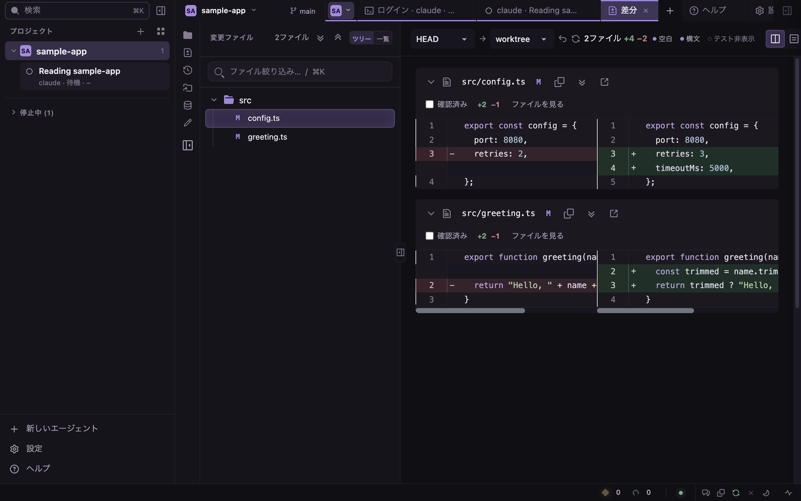

# code-viewer

手元で動く、リポジトリのコードと git の差分をブラウザで読むツールです。AI のコーディングエージェント（claude・codex）を tmux で動かして、様子を見ることもできます。

[English](README.md) | 日本語



- リポジトリのファイル・差分・コミット履歴・Blame・すべての作業ツリーを読めます。
- claude や codex を tmux で起動し、どれが入力待ちかを見て、ターミナルのタブで返事できます。
- claude・codex のアカウントを複数持ち、それぞれの使用量を見られます。
- SQLite・PostgreSQL・MySQL・Redis・Elasticsearch・DynamoDB・S3 互換ストレージ・Cloudflare D1 の中身を見られます。
- AI エージェントからは CLI・MCP サーバ・同梱のスキルで使えます。

code-viewer を 1 つ起動すれば、すべてのプロジェクトを同じポートで開けます。待ち受けは `127.0.0.1` だけです。

## 目次

- [必要なもの](#必要なもの)
- [使い始める](#使い始める)
- [起動のしかた](#起動のしかた)
- [できること](#できること)
- [データストア](#データストア)
- [AI エージェント向けの CLI](#ai-エージェント向けの-cli)
- [MCP サーバ](#mcp-サーバ)
- [同梱のスキル](#同梱のスキル)
- [code-viewer が書くファイル](#code-viewer-が書くファイル)
- [外出先から接続する](#外出先から接続する)
- [開発](#開発)
- [ライセンス](#ライセンス)

## 必要なもの

| もの | 使う機能 |
|---|---|
| Node.js 22 以上、git | すべて |
| [tmux](https://github.com/tmux/tmux) | エージェント、アカウントのログイン、tmux のペイン（シェルは tmux が無くても使えます） |
| claude か codex の CLI（両方でも可） | エージェントを動かす |
| `better-sqlite3`（任意の依存。パッケージと一緒に入ります） | SQLite の表示、スナップショット、`code-viewer query` |
| `@lydell/node-pty`（任意の依存。パッケージと一緒に入ります） | ターミナルのタブ（シェルと、タブで開いたエージェント） |
| Chrome | アプリとして入れる（任意） |

## 使い始める

1. git のリポジトリで次を実行します。

   ```sh
   npx @youtyan/code-viewer --open
   ```

   `http://127.0.0.1:<port>/p/<key>/` が出て、ブラウザで開きます。リポジトリは左のサイドバーの **プロジェクト** に並びます。
2. ほかのリポジトリは、**プロジェクト** の横の **+** で足すか、そのフォルダで `npx @youtyan/code-viewer` を実行します。
3. tmux を入れます（`brew install tmux`。Linux ではパッケージマネージャで）。
4. **設定 → アカウント** で、claude か codex の行の **ログイン** を押します。
5. （おすすめ）**設定 → エージェント → エージェント連携** で **入れる** を押してフックを入れます。エージェントの状態が正しく出ます。
6. サイドバーの下の **新しいエージェント** で、claude か codex・アカウント・プロジェクトを選んで **起動** を押します。
7. （任意）**すべてのエージェント** の画面（`g a`）で **通知を有効にする** を押します。
8. （任意）AI に同梱のスキルを入れます: `npx @youtyan/code-viewer skill install`

うまく動かないときは `npx @youtyan/code-viewer doctor` を実行します。左のサイドバーの下の **ヘルプ** で、各手順を画面のキャプチャ付きで説明しています。

## 起動のしかた

```sh
npx @youtyan/code-viewer                  # 入れずに実行
pnpm dlx --allow-build=better-sqlite3 @youtyan/code-viewer   # pnpm で同じこと
npm install -g @youtyan/code-viewer       # 入れて使う
code-viewer
```

- 別のリポジトリで `code-viewer` を実行すると、動いている code-viewer にそのリポジトリが加わり、URL が出ます。2 つ目のサーバは起動しません。
- 別のバージョンの code-viewer が動いているときは、それがどこで動いているかを出して、起動しません。古いほうを Ctrl+C で止めます。
- 動いている間に code-viewer を更新・入れ直すと、プロジェクトを起動できなくなります。Ctrl+C で止めて、もう一度起動します。
- 差分の画面は `HEAD` と作業ツリーを比べます。ほかの範囲は、差分の上の比較元・比較先の選択で選びます。

### オプション

| オプション | 意味 |
|---|---|
| `--cwd <dir>` | 開くリポジトリ（既定: 今のディレクトリ） |
| `--open` | 既定のブラウザで URL を開く |
| `--port <port>` | 待ち受けるポート（既定: 空いているポート） |
| `--idle-stop <seconds>` | 使われないままこの秒数が経ったプロジェクトのプロセスを止める（既定 `600`、`0` は止めない）。ターミナルとエージェントは動き続けます |
| `--remote-access <file>` | この外部接続の設定ファイルを使い、起動時に待ち受けを開く（付けなくても設定 → **外部接続** で同じことができます。[外出先から接続する](#外出先から接続する)） |
| `--standalone` | このリポジトリだけの別のサーバを起動する |
| `--bin <name>=<absolute-path>` | 起動したリポジトリで使う `git`・`rg`・`docker`・`gh`・`tmux` の場所 |
| `--scope-omit-dir <name>` | 起動したリポジトリで中を読まないディレクトリ（複数可。既定の一覧と設定の一覧の代わりに使います） |
| `--version`, `-v` / `--help`, `-h` | バージョン / すべてのヘルプ |

- `CODE_VIEWER_BIN_GIT`・`CODE_VIEWER_BIN_RG`・`CODE_VIEWER_BIN_DOCKER`・`CODE_VIEWER_BIN_GH`・`CODE_VIEWER_BIN_TMUX` は、すべてのプロジェクトに同じ場所を指定します。開いたリポジトリの外にある、絶対パスの実行ファイルに限ります。
- code-viewer が既に動いているときは、`--port`・`--idle-stop`・`--bin`・`--scope-omit-dir` は動いている code-viewer には反映されません（警告が出ます）。`--remote-access` はエラーになって止まります。
- `--remote-access` と `--idle-stop` は `--standalone` と一緒に使えません。

### SQLite とインストールスクリプト

`better-sqlite3` は、入れるときにネイティブモジュールをビルドします。これが無いと、SQLite の表示・スナップショット・`code-viewer query` のすべてのコマンドが失敗します。ほかの機能は動きます。ドライバを読み込めているかは `code-viewer doctor` で分かります。

- npm 11 は、インストールスクリプトを確認していないパッケージの一覧を出すことがあります。スクリプトはそのまま動きます。明示的に許可するなら `npm install -g --allow-scripts=better-sqlite3 @youtyan/code-viewer`、または `npm config set allow-scripts=better-sqlite3 --location=user`（npx にも効きます）。
- `pnpm dlx` は、`--allow-build=better-sqlite3` を付けないとビルドを飛ばします。
- ビルドされていないときは、code-viewer を入れた場所で `npm rebuild better-sqlite3` を実行します。

## できること

### 画面の配置

| 場所 | 中身 |
|---|---|
| 左のサイドバー | 検索、プロジェクトとそのエージェント、**新しいエージェント**、**設定**、**ヘルプ** |
| 一覧の列 | 開いているプロジェクトとブランチ、6 つの画面のアイコン、ファイル一覧、今の画面の一覧（変更ファイル・コミット・作業ツリー） |
| タブ列 | 開いたファイルと画面。プロジェクトごとのグループにまとまります |
| 本文 | 前面のタブ。左右 2 面に分けられます |
| 最下段 | 入力待ち・作業中のエージェントの数、アカウントの使用量、注釈、AI 用コンテキストのコピー、自動更新、明暗、リポジトリのウェブページ、環境ドクター |

- 画面: **ファイル**（`g r`）、**差分**（`g d`）、**履歴**（`g h`）、**作業ツリー**、**データストア**（`g b`）、**ワークログ**（`g j`）。
- 差分・履歴・作業ツリー・データストア・ワークログは、プロジェクトごとに 1 つのタブです。ファイルはタブではありません。タブを選んでいないときに出るのがフォルダの表示です。
- 1 回押して開いたファイルは斜体の仮のタブで、次のファイルに置き換わります。ダブルクリックか **開いたままにする** で残ります。中ボタンか ⌘/Ctrl+クリックで開くと、置き換わらないタブで開きます。
- 別のリビジョンのファイルは `a.ts @ 1a2b3c4` のような名前の別のタブで開きます。
- タブのグループ: プロジェクトごとに色の札があります。札を押すとグループを畳みます。札の ▾ には **新しいシェル**、**新しいエージェント…**、そのプロジェクトの画面、**このグループを閉じる** があります。
- タブの右クリック: **閉じる**、**ほかを閉じる**、**右側を閉じる**、**パスをコピー**、**右に分割**、**反対側へ移す** など。ドラッグで並べ替えます。
- 左右に分ける: タブ列の右端の分割のボタン、**右に分割**、またはタブを右半分へドラッグすると左右 2 面になります。右の面に置けるのは、ファイル・ターミナル・画像です。差分や履歴などの画面は左の面に出ます。`g o` でもう一方の面へ移ります。
- 列は手で畳めます。窓が狭いと自動で畳みます。
- タブはすべてのプロジェクト・すべての窓で共通です。
- 戻る・進むでスクロールの位置も戻ります。

### ファイル

- ファイルの上に **コード**・**プレビュー**・**Blame**・**履歴** のタブがあります。
- プレビュー: Markdown、HTML、CSV / TSV、画像、動画、音声、PDF。
- Markdown: 目次、タスクリスト、Mermaid の図（クリックで拡大）、Shiki の色分け。相対リンクは GitHub と同じ所へ飛びます。
- CSV / TSV: 検索・列ごとの絞り込み・並べ替えのできる表になります。
- 大きなファイルは軽い表示で開きます。全文をコピーするか、全部を表示する画面に切り替えられます。
- 行番号をドラッグして行を選び、**AI参照をコピー** で `@path#start-end` をコピーします（Shift でコードも付きます）。**この行の履歴** で、その行を変えたコミットが出ます（`git log -L`）。
- リモートが GitHub なら、リポジトリとファイルは **GitHubで開く**、選んだ行は **選択行をGitHubで開く** で開けます。
- 名前を ⌘/Ctrl+クリックするか `g .` で定義へ飛びます。
- ファイル一覧の絞り込み: そのままの文字、`/正規表現/`、`~あいまい`、`*.ts` や `src/**` のような glob。
- フォルダの一覧には **最終コミット日時** と **ローカル更新日時** があり、どちらでも並べ替えられます。
- シンボリックリンクは `→ リンク先` と出て、リンク先を開きます。
- フォルダを OS のファイルマネージャで開く、フォルダを作る、ファイルをゴミ箱に入れる（⌘/Ctrl+Z で戻せます）ことができます。作業ツリーのフォルダへのファイルのアップロードもできます（**設定 → ファイル → アップロード**）。
- ファイルが変わると、開いているタブすべてにすぐ反映されます。
- ビルド・依存・ツールのフォルダ（`node_modules`・`dist`・`vendor`・`bin`・`log`・`tmp`・`.venv` など）は一覧に出ますが、中は読まず、検索もしません。一覧は **設定 → ファイル** で変えられます。
- Linux では、変更を監視するフォルダの数に上限があります（**設定 → 詳細 → ファイル変更の監視**）。上限に達すると帯が出ます。

ファイル一覧の印:

| 印 | 意味 |
|---|---|
| `M` | 変更 |
| `A` | 追加（ステージ済み） |
| `D` | 削除 |
| `R` | 名前の変更 |
| `C` | 衝突（マージの衝突） |
| `U` | 未追跡（まだ `git add` していない） |
| `I` | `.gitignore` で無視 |

### 差分

- 統合と分割の表示、空白だけの変更を隠す（既定で入っています）、テストのファイルを隠す。
- ファイルごとの **確認済み** のチェック。
- **ファイルを見る** でその場にファイル全体を出し、**差分を見る** で戻ります。
- 画像・動画・音声は変更の前後を並べます。
- ファイルと同じように、差分からも `@path#start-end` をコピーできます。
- 差分の上の比較元・比較先の選択で、比べるものを選びます（既定は `HEAD` と作業ツリー）。

### 検索

- ⌘K / Ctrl+K: プロジェクト・エージェント・セッション・ファイル・操作・テーマを 1 つの欄で探します。空のときは最近開いたファイルが出ます。
- ⌘G / Ctrl+G: コードを検索します。正規表現（Alt+R）、大文字と小文字の区別（Alt+C）、単語単位（Alt+W）。`path:<フォルダか glob>` で範囲を絞ります。
- **固定**（Ctrl+Enter）で結果を **検索** のタブに残します（`/search?q=<query>`）。
- 左のサイドバーの上の **検索** で ⌘K の欄が開きます（Shift+クリックでコードの検索）。

### 履歴と Blame

- **履歴**: ブランチごとのコミットと、選んだコミットの変更ファイルと差分。
- 絞り込み: メッセージの文字（1 つの語句として、大文字と小文字を区別せずに探します）、sha の先頭、`author:`、`path:`、`since:` / `after:` / `until:` / `before:`、`code:<text>`（`git log -S`）、`merges:no` / `merges:only`。空白を含む値は `author:"Sample Name"` のように引用符で囲みます。
- 2 つ目のコミットを Shift+クリックすると、その間の変更をまとめて見られます。マージコミットでは比べる親を選べます。
- フォルダの画面の **履歴** ボタンで、そのフォルダの履歴が出ます。`g h` で今見ている ref の履歴を開きます。
- `/p/<key>/history?ref=<branch>&commit=<sha>` のリンクで同じ画面を共有できます。
- ファイルの **Blame** は行をコミットごとにまとめ、**履歴** はそのファイルを変えたコミットを並べます。
- ↑ / ↓ でコミットを移ります（一覧にフォーカスがあるときは `j` / `k` も）。

### 作業ツリー

- リポジトリのすべての作業ツリーと、選んだものの変更ファイル・コミット・差分。
- 各行に、基準のブランチから進んだ・遅れたコミットの数を出します。そのままマージできるか、ぶつかるならどのファイルかも出します（`git merge-tree` で調べるので、ファイルには触りません）。
- 2 つ以上の作業ツリーが同時に変えているファイルを、上の帯に出します。
- 作業ツリーは `.worktrees/` の下に作ります。削除はフォルダを消し、ブランチは残します。
- 行の ⋯ メニュー: **フォルダを開く**、**パスをコピー**、**別タブで見る**、**サーバを止める**、**マージのコマンドをコピー**、**この作業ツリーを削除**。

### プロジェクト

- 足す: **プロジェクト** の横の **+**、パレット（⌘K）の **プロジェクトを追加…**、またはそのフォルダで `code-viewer`。
- 切り替える: サイドバーのプロジェクト、一覧の列の上のプロジェクト名（`p`）、または ⌘⇧↑ / ⌘⇧↓（Ctrl+Shift+↑ / ↓）。ページは読み直さず、タブ・ターミナル・未読の印はそのまま残ります。
- サイドバーには、使っている登録済みのプロジェクト（エージェント・シェル・プロジェクトのプロセスのどれかが動いているもの）が並べた順に出ます。その下に **tmux で検出**（登録していないが、エージェントが動いているプロジェクト）、最後に **停止中**（畳んであります）が続きます。
- 見出しのドラッグか Alt+↑ / Alt+↓ で並べ替えます。
- プロジェクトには色と 2 文字の頭文字が付きます（`code-viewer` → CV）。見出しの ⋯ で **色…**・**名前を変える…**・**登録を外す…** ができます（リポジトリには触りません）。
- テーマ・言語・キーの割り当て・通知は、すべてのプロジェクトで共通です。

### エージェント

- **新しいエージェント**: 選んだアカウントとプロジェクトで、claude か codex を tmux の新しいウィンドウで起動します。画面に実行するコマンドと、各アカウントの 5 時間と 1 週間の使用量が出ます。
- 起動するコマンドは **設定 → アカウント → 起動コマンド** で変えられます。
- エージェントは、どの画面でもサイドバーのプロジェクトの下に並びます。押すと、そのペインをターミナルのタブで開きます。ポインタを載せると、画面の最後の数行が出ます。
- **すべてのエージェント**（`g a`）: このマシンの tmux で動くエージェントを、プロジェクトごとに全部並べます。入力待ちが先頭です。**すべてのペイン** でただのシェルも出ます。
- 最下段に、入力待ちと作業中のエージェントの数が出ます。ブラウザのタブの題には未読の数が出ます。
- **すべてのエージェント** の **通知を有効にする** で、デスクトップ通知が出るようになります。何で通知するかは **設定 → エージェント → エージェントの通知** で選びます。通知は https か localhost でだけ出ます。
- エージェントを右クリックして **別のアカウントで続ける…** を選ぶと、同じ tmux セッションの新しいウィンドウで、別のアカウントのエージェントが起動します。前のエージェントの会話記録を読んで作業を続けます。フックが入っていて、前のエージェントがその後に 1 回メッセージを受け取っている必要があります。前のエージェントは動いたままです。

| 状態 | 意味 |
|---|---|
| 入力待ち | 返事か許可を待っている |
| 作業中 | 作業をしている |
| 完了・未読 | 終わっていて、まだ開いていない |
| 待機 | 次の指示を待っている |

状態の決め方（上ほど優先）:

1. フック: claude と codex が自分で知らせます。**設定 → エージェント → エージェント連携** の **入れる** を押すと、書き込む前に、書くファイルと差分を見せます。元の中身はバックアップに残し、ほかのフックは消しません。設定のファイルが dotfiles などから作られているときは、書き込まずに、元のファイルへ足すフックを見せます。codex は `/hooks` で信頼するまで新しいフックを動かしません。
2. 画面の文言のルール: 画面に出ている文字で決めます。JSON のルールは **設定 → 詳細** で直せます。
3. 画面の動き: 画面が変わり続けているか。

### アカウント

- アカウントは、claude か codex の設定ディレクトリ 1 つです（`CLAUDE_CONFIG_DIR` / `CODEX_HOME`）。
- **設定 → アカウント → アカウントを追加…**: 既定の設定ディレクトリから設定をリンクした新しいディレクトリを作るか、既にあるものを登録します。作る前に、何を作るかを見せます。ログインの情報と履歴は共有しません。
- **ログイン** は、公式のログインのコマンドを tmux の新しいウィンドウで実行します。
- ログインの状態とメールアドレスは `claude auth status`・`codex login status`・`codex app-server` から取ります。code-viewer はトークンを読みません。
- 使用量: 5 時間と 1 週間の枠と、リセットされる時刻。code-viewer のページを開いている間は 5 分ごとに確かめます（**すべて更新** ですぐ確かめます）。確かめるためにモデルへメッセージは送りません。
- 同じことをターミナルから: `code-viewer accounts`（`list`・`plan`・`create`・`register`・`login`・`wait`・`rename`・`remove`）。

### ターミナル

- 最後のタブの後ろの **+**（Ctrl+\`）で、**新しいシェル**、既にあるシェルと tmux のペイン、**ツール**、**検索** などを開きます。
- シェルは、PTY の上で `$SHELL` を動かします（ログインシェルとしては起動しません）。描画は xterm.js です。シェルを開くには `@lydell/node-pty` が要ります。
- シェルは code-viewer を止めると終わります。tmux のタブは繋ぎ直します。長い作業は tmux で動かします。
- tmux のセッションごとに 1 つのタブです。同じセッションの別のペインを開くと、同じタブでそのペインに切り替わります（tmux 側でも切り替わるので、同じセッションに繋いでいる自分の端末も切り替わります）。tmux のウィンドウが終わるか detach すると、タブは閉じます。
- タブを閉じても、シェルとエージェントは止まりません。止めるのはタブの右クリックの **セッションを止める** です。
- 右クリックの **閲覧のみ** で入力を止めます。同じメニューで文字の大きさも変えられます。
- ターミナルに出たパスの画像は、ターミナルの横の画像の棚に並びます。押すと画像のタブで開きます。
- 画像を貼り付ける（⌘V / Ctrl+V）とエージェントに渡せます。`.code-viewer/pasted/` に保存し、そのパスを、送信はせずに入力します。
- 画面の URL とファイルのパスはリンクになります（tmux がマウスを受けるときは ⌘/Ctrl を押しながら）。
- ターミナルの大きさは、操作している画面（PC かスマホ）に合います。
- どの URL にも `?terminal=<shell>` を付けると、そのシェルのタブが前面に出ます。
- ブラウザを動かしているマシンに Nerd Font が入っていれば、Powerline の記号とファイルのアイコンが出ます。

> tmux のウィンドウの大きさは 1 つだけです。同じセッションを別の端末でも開いていると、小さいほうの右と下が欠けます。`set -g window-size smallest` にすると、どちらにもウィンドウ全体が出ます。

### ツール

- **ツール** のタブ（`/tools?tool=markdown`・`mermaid`・`json`）で、貼り付けたテキストを扱います: Markdown のプレビュー、Mermaid のプレビュー（拡大・ドラッグ）、JSON / YAML の整形と変換。
- 書きかけは `.code-viewer/tools.json` に残ります。

### AI のコード注釈

- エージェントが `code-viewer annotate` でコードの行に注釈を付けます。**新しい注釈へ自動移動** が入っていれば、新しい注釈の場所へ移ります。
- 注釈のパネル（最下段）で、セッションごとに注釈を一覧・検索できます。**注釈を追加** で自分でも書けます。
- 再生ボタンで注釈を読み上げます。
- **AI用の参照をコピー** で、その注釈を AI に伝える文をコピーします。
- 注釈は `.code-viewer/annotations.json` に保存されます。

### ワークログ

- 日々の作業の記録と、エージェント向けのタスクのキューです。`.code-viewer/daily-journal.json` と `.code-viewer/tasks.json` に保存されます。
- エージェントは `code-viewer journal` で使います。

### アプリとして入れる

- Chrome のアドレスバーの右端のインストールのアイコンから入れます。Chrome がインストールを出せるときは、ヘルプ → **アプリとして入れる** にも **code-viewer をインストール** のボタンが出ます。
- 専用の窓で開き、窓の上の帯がプロジェクトの色になります。
- その窓では、ブラウザのタブのキーが code-viewer のタブに効きます: ⌘W / Ctrl+W で前面のタブを閉じる（窓は閉じません）、⌘T / Ctrl+T で **+** のメニュー、⌘⇧T で最後に閉じたタブを開き直す、⌘1〜⌘8 でタブを選び ⌘9 で最後のタブ、Ctrl+Tab で次のタブ、⌘← / ⌘→（Ctrl+← / Ctrl+→）で前・次のタブ。
- Windows と Linux では、ターミナルにフォーカスがある間、これらの Ctrl のキーはシェルに渡ります。

### スマホでの操作

幅 640px 以下の窓では、スマホ向けの画面になります（高さ 500px 以下のタッチの画面も同じです）。できるのは、エージェントへの返事、差分とファイルの閲覧、プロジェクトの切り替えです。

- 下端の帯: **プロジェクト**、**ファイル**、**差分**、**エージェント**（入力待ちの数付き）、**一覧**。
- エージェントを開くと、そのペインだけを全画面で出します。PC の tmux の配置は変わりません。
- 番号の選択肢はボタンになります。下の欄に打った文字は Enter と一緒に送られます。画像のボタンで写真を添付できます。
- **PC と同じ** で、PC の幅のままペインを出します。
- 長押しで右クリックのメニューが出ます。ターミナルの上で 2 本の指を広げる・狭めると、文字の大きさが変わります。
- 外出先から使うには [外出先から接続する](#外出先から接続する) を見てください。

### 設定・ヘルプ・ショートカット

- **設定**（左のサイドバーの下、`/settings`）: **表示**、**エージェント**、**アカウント**、**ショートカット**、**ファイル**、**詳細**。検索の欄もあります。
- 表示: 明暗、テーマ（既定・夜の海・森・砂・薄墨・桜・苔・霧・琥珀・藍・GitHub）、ターミナルの明暗、画像の棚の場所、UI とコード表示の文字サイズ、言語（English / 日本語）。
- ショートカット: すべての操作に 1 つ以上のキーを割り当てられます。入力欄の中・端末の中・PWA の窓だけのどこで効くかも選べます。JSON で書き出し・読み込み・直接編集ができます。
- 打ち込む欄（読まないディレクトリ・隠す名前・画面の文言のルール）とショートカットの変更は、**変更を保存** を押すと反映されます。選ぶ設定は、選ぶとすぐ効きます。
- **ヘルプ**（`/help`）: 画面のキャプチャ付きの手順。英語と日本語があります。
- どの画面でも `?` でよく使うキーが出ます。

### 環境ドクター

最下段の右端のアイコン（ターミナルでは `code-viewer doctor`）で次を調べます。

- Node / Bun / ABI、code-viewer のバージョンと、どこから動いているか（npx のキャッシュか手元か）
- SQLite のドライバ、スナップショットの保存先、git、`rg`、GitHub CLI、tmux、`@lydell/node-pty`
- 見つけたデータストアと保存した接続のすべてに、最小限の読み出し。Docker / Compose
- エージェントのフック、アカウント、プロジェクト、動いているサーバ
- claude / codex の CLI のバージョン（code-viewer が確かめたバージョンと並べて）
- claude / codex のバージョンと、code-viewer が動作を確かめたバージョン

各行に何が失敗したかを出します。警告の多くには直し方も付きます。

## データストア

**データストア**（`g b`）を開きます。

| 種類 | 自動で見つける元 | 直せるもの | ブラウザでのスナップショット |
|---|---|---|---|
| SQLite（`.db`・`.sqlite`・`.sqlite3`・`.s3db`） | リポジトリの中のファイル | 行 | ○ |
| PostgreSQL・MySQL | 動いている compose のサービス、Supabase CLI（PostgreSQL） | 行 | ○ |
| Cloudflare D1 | —（接続を足す） | — | ○ |
| Redis | 動いている compose のサービス | 文字列の値、文字列のキーの追加、キーの削除 | CLI だけ（compose のサービス） |
| Elasticsearch | 動いている compose のサービス | ドキュメント | CLI だけ（compose のサービス） |
| DynamoDB（LocalStack） | 動いている compose のサービス | — | — |
| S3 互換（MinIO・LocalStack・Cloudflare R2） | 動いている compose のサービス | テキストのオブジェクト（編集・作成）、削除 | — |

### 見つけ方

- SQLite のファイルは 3 階層まで探します（最大 50 ファイル）。
- `docker-compose.yml`・`docker-compose.yaml`・`compose.yml`・`compose.yaml` を、リポジトリとその下のフォルダ（3 階層まで、最大 30 サービス）から読みます。動いているサービスだけを出すので、Docker の CLI が要ります。MariaDB は MySQL、OpenSearch は Elasticsearch として扱います。
- `supabase start` の `supabase/config.toml` も見つけます。Postgres のコンテナは `docker ps` で探します。
- SQLite 以外は手でも足せます: データストアの選択の横の **+**（**データストア接続を追加**）。**接続テスト** で保存する前に確かめられます。
- 手で足した接続には、データベースの CLI は要りません。PostgreSQL・MySQL・Redis は同梱の Node.js のドライバ、D1・Elasticsearch・S3・DynamoDB は HTTP で繋ぎます。
- compose と Supabase のサービスは、`docker exec` でコンテナの中の `psql`・`mysql`・`redis-cli`・`curl` を使って読みます。S3 と DynamoDB は、ホストへ公開したポートがあればそれを使います。
- MinIO はホストへ公開したポートが要ります。ポートの無い LocalStack は `docker exec … curl` で読みます。そのときのオブジェクトの作成・編集、画像のプレビュー、**元データを開く**、**ダウンロード** には、公開したポートが要ります。

### 認証情報

- ホスト・エンドポイント・アカウント ID など秘密でない値は `.code-viewer/datastore-connections.json` に書きます。
- ユーザー名・パスワード・アクセスキー・トークンは、リポジトリに書きません。macOS ではキーチェーン（サービス名 `code-viewer`）に置きます。ほかの OS ではメモリにだけ置くので、再起動したら入れ直します。

### ブラウザでできること

- タブ: 複数のデータベースを開いておき、切り替えて見られます。
- 表: 並べ替え、絞り込み、コピー、CSV / JSON への書き出し（100,000 行まで）。
- 表は新しい行から並びます（`updated_at`・`created_at`・整数の主キーの順）。表の上の **新しい順** で表の元の順に戻せ、選んだほうを覚えます。
- 行番号の右の **変更** の列に、各行が足された・変わった時期（`5m ago` など）が出ます。読み直すと、前回から足された・変わった行に印と件数が出ます。
- 表の上のタイムゾーンの選択で、日時の列（UNIX 時刻も）を、このコンピュータ・UTC・任意の IANA のタイムゾーンで出し直せます。名前か時差（`tokyo`・`+9` など）で探せます。書き出しとセルの詳細は、保存されている値のままです。
- セルをドラッグ（または Shift+クリック・Shift+矢印キー、⌘A / Ctrl+A で全行）で選び、⌘C / Ctrl+C でタブ区切りの文字としてコピーできます。Excel にそのまま貼れます。Shift も押すと列名も付きます。
- NULL と空の文字列は、形の違う札で出します（NULL は塗りつぶし、空の文字列は点線）。
- **編集**（SQLite / PostgreSQL / MySQL）: 行を直す・足す・消すことができ、**コミット** で 1 つのトランザクションとしてまとめて反映します。更新と削除には主キーが要ります。
- セルを選ぶと値が出ます。**行全体** では、すべての列を型付きで出します（JSON は整形、日時は選んだタイムゾーン）。
- 外部キーのセルから、その行が参照している行と、その行を参照している行を、件数付きで開きます（行の無い関係は隠せます）。
- 表の上の SQL の欄: 読むだけのクエリを実行します。SQLite と D1 は `SELECT`・`PRAGMA`・`EXPLAIN`・`WITH`、PostgreSQL と MySQL は `SELECT`・`EXPLAIN`・`WITH`・`SHOW`・`DESCRIBE` で、読み取り専用のトランザクションで実行します。
- **スキーマ**（カラム・コメント・インデックス・外部キー・トリガー・DDL）、**ER** 図、全テーブルを対象にした **検索**。
- **スナップショット**: 選んだテーブルを今の状態で取っておき、2 つを比べます（足された・変わった・消された行）。
- 下に **クエリ履歴** と **ログ**（どちらかを開くまで閉じています）。
- **Rails FK 推測**: Rails の名前の付け方（`user_id → users.id`）から外部キーを足します。

## AI エージェント向けの CLI

`code-viewer agent-help` で、AI 向けのコマンドの一覧が出ます。各コマンドの説明は `code-viewer <command> agent-help` で出ます。

| コマンド | すること | 動いている code-viewer が要るか |
|---|---|---|
| `status` | ブランチ、リモート、変更ファイル、最近のコミット、次に打つコマンド | 要らない |
| `file` | 1 つのパスの Blame・履歴・中身・差分 | 要らない |
| `search` | コードの検索（`code`）とファイル名の検索（`files`） | 要る |
| `query` | データストアへの読むだけのクエリ、全テーブルの検索、スナップショットと差分 | 要る |
| `annotate` | コードの行に注釈を付ける | 要る |
| `journal` | ワークログの記録とタスクのキュー | 要る（`github-issues` と `--dry-run` は要らない） |
| `terminal` | ターミナルとその状態の一覧、ペインの文字の読み出し、状態の報告 | 要る |
| `accounts` | claude / codex のアカウントを足してログインする | 要る |
| `skill` | 同梱のスキルを入れる | 要らない |
| `doctor` | 環境を調べる（エラーがあれば終了コード `1`） | 要らない |

- code-viewer は動いているがこのリポジトリをまだ開いていないときは、CLI が code-viewer に開くよう頼み（プロジェクトの一覧にも加わります）、1 回の要求につき最大 30 秒待ちます。code-viewer が動いていなければ、先に `code-viewer` を起動します。
- `terminal` と `accounts` は、動いている code-viewer そのものとやり取りし、プロジェクトは開きません。
- `--cwd <repo>` と `--server <url>` で対象を変えられます。

### status

```sh
code-viewer status
code-viewer status --json
code-viewer status --ref main --limit 20 --json
```

### file

```sh
code-viewer file blame --path src/sample.ts --json
code-viewer file history --path src/sample.ts --limit 10 --json
code-viewer file history --path src/sample.ts --query "author:tester" --json
code-viewer file show --path src/sample.ts --start 100 --end 150 --json
code-viewer file show --path src/sample.ts --ref main --json
code-viewer file diff --path src/sample.ts --json
code-viewer file diff --path src/sample.ts --from HEAD~1 --to HEAD --full --json
code-viewer file diff --path new_sample.ts --untracked --json
```

- `blame` と `history` はタブ区切りの文字、`show` はファイルの中身、`diff` は unified 形式の差分を出します。
- `file diff` は既定では一部だけ出し、`--full` で全部出します。

### search

```sh
code-viewer search code --term "TODO" --json
code-viewer search code --term "fn handler" --regex --path src --path tests --ref main --json
code-viewer search code --term "Token" --case-sensitive --word --path "src/**/*.ts" --json
code-viewer search files --term "userId"
code-viewer search files --term "src/**/*.test.ts" --max 200 --json
```

- `search code` は ⌘G と同じ検索です。作業ツリーは `rg`（無ければ組み込みの検索。正規表現には `rg` が要ります）、ほかの ref は `git grep` で探します。`--case-sensitive` を付けない限り大文字と小文字を区別しません。
- `search files` は ⌘K と同じ順位付けです。単語はあいまい検索、`*` か `?` を含むと glob になります。`--max` の既定は 50 です。
- `--json` を付けないときは、見つからないと stderr に `no matches` / `no matching files` を出し、終了コード 0 で終わります。

### query

```sh
code-viewer query sources --json
code-viewer query sources --commands
code-viewer query schema --db app.db --json
code-viewer query schema --db docker:pg-svc --schema analytics --with-columns --json
code-viewer query columns --db app.db --table users --json
code-viewer query ddl --db app.db --table users

code-viewer query exec --db app.db --sql "SELECT * FROM users LIMIT 10" \
    --title "Sample users" --body "Checking user data shape."
code-viewer query exec --db app.db --sql "SELECT count(*) FROM orders" \
    --max-rows 1 --no-save
code-viewer query list --db app.db --json

code-viewer query search --db app.db --term "needle@example.com" --json
code-viewer query search --db app.db --term "needle@example.com" \
    --tables users,orders --max-hits 20 --include-non-text --json

code-viewer query snapshot create --db app.db --tables users,orders \
    --note "Before user registration test" --wait --json
code-viewer query snapshot list --db app.db --json
code-viewer query diff tables --before snap-abc123 --after snap-def456 --json
code-viewer query diff rows --before snap-abc123 --after snap-def456 \
    --table users --json
```

- `query sources` で `--db` に渡す ID が出ます。`--commands` を付けると、そのまま貼れる次のコマンドが出ます。
- `query exec` の結果は、ブラウザで見られるクエリ履歴に残ります（`--no-save` で残しません）。行が全部そろっているとみなす前に、`truncated` を確かめます。
- Redis・Elasticsearch・S3 には読むだけのサブコマンドがあります。DynamoDB には無いので、データストアの画面で見ます。

```sh
code-viewer query redis databases --db docker:redis-svc --json
code-viewer query redis keys --db docker:redis-svc --db-index 0 --pattern '*' --count 500 --json
code-viewer query redis value --db docker:redis-svc --db-index 0 --key sample:key --json
code-viewer query elasticsearch indices --db docker:es-svc --json
code-viewer query elasticsearch mapping --db docker:es-svc --index sample-index --json
code-viewer query elasticsearch docs --db docker:es-svc --index sample-index --q 'status:active' --size 10 --json
code-viewer query elasticsearch doc --db docker:es-svc --index sample-index --id sample-id --json
code-viewer query s3 buckets --db docker:s3-svc --json
code-viewer query s3 objects --db docker:s3-svc --bucket sample-bucket --prefix logs/ --limit 50 --json
code-viewer query s3 folder --db docker:s3-svc --bucket sample-bucket --prefix logs/ --json
code-viewer query s3 head --db docker:s3-svc --bucket sample-bucket --key logs/sample.json --json
code-viewer query s3 text --db docker:s3-svc --bucket sample-bucket --key logs/sample.json
```

すべてのフラグは `code-viewer query --help`、決まりごとは `code-viewer query agent-help` で出ます。

### annotate

```sh
code-viewer annotate start --title "How the update flow works"
code-viewer annotate add --file src/server.ts --line 120-140 \
  --body "Each browser tab keeps one event stream open here."
code-viewer annotate add --file src/app.ts --line 96 --from HEAD~1 --to worktree \
  --body "After the fix, reloads keep the scroll position."
code-viewer annotate add-db --db app.db --table orders --tab data \
  --filter status=failed --sort created_at:desc \
  --body "The failed orders being discussed."
```

- サブコマンド: `start`・`add`・`add-db`・`move`・`edit`・`rename`・`list`・`delete <id>`・`clear`。
- 本文は Markdown で、`--body`・`--body-file <path>`・標準入力のどれかで渡します。
- `add` は最新のセッションに足します。`--session <id>` でセッションを選び、`--before <id>`・`--after <id>`・`--position <n>` で位置を決めます。
- `add-db` はデータストアの画面を開きます: `--tab <data|schema|query|er|search|snapshot>`、`--filter`、`--sort`、`--row`、`--sql` と `--run-query` など。

### journal・terminal・accounts

```sh
code-viewer journal task-next --json
code-viewer terminal list --attention
code-viewer terminal capture --target "$TMUX_PANE" --json
code-viewer accounts list
```

すべてのサブコマンドは `code-viewer <command> --help` で出ます。

## MCP サーバ

code-viewer が動いている間、プロジェクトごとに MCP サーバとしても使えます（Streamable HTTP の JSON-RPC 2.0。POST だけ）。

```
http://127.0.0.1:<port>/p/<key>/_mcp
```

起動したときに出るプロジェクトの URL の後ろに `_mcp` を付けたものです（`--standalone` では `http://127.0.0.1:<port>/_mcp`）。Streamable HTTP に対応した MCP クライアントをここに向けます。ほかに動かすものはありません。

| ツール | すること |
|---|---|
| `code_viewer_agent_help` | AI 向けの CLI のコマンドの一覧 |
| `code_viewer_status` | ブランチ、リモート、変更ファイル、最近のコミット |
| `code_viewer_file_show` | 任意の ref のファイル（行の範囲も可） |
| `code_viewer_file_blame` | 行ごとの Blame |
| `code_viewer_file_history` | 1 つのパスのコミット履歴 |
| `code_viewer_file_diff` | 1 つのパスの差分 |
| `code_viewer_search_files` | パスをあいまい検索か glob で順位付け |
| `code_viewer_search_code` | コードの検索 |
| `code_viewer_datastore_sources` | データストアの ID |
| `code_viewer_datastore_schemas` | SQL のデータストアのスキーマ |
| `code_viewer_datastore_schema` | テーブル、インデックス、外部キー、カラム |
| `code_viewer_datastore_columns` | 1 つのテーブルのカラム |
| `code_viewer_datastore_ddl` | `CREATE` 文とトリガー |
| `code_viewer_datastore_query` | 読むだけの SQL（SQL の欄と同じ文が使えます） |
| `code_viewer_datastore_history` | 保存したクエリ履歴 |
| `code_viewer_terminal_list` | ターミナルの状態 |
| `code_viewer_terminal_capture` | tmux のペインかシェルの文字 |
| `code_viewer_terminal_state` | エージェントが自分の状態を知らせる（書き込むのはこれだけ） |

## 同梱のスキル

| スキル | AI に頼めること |
|---|---|
| `code-viewer-accounts` | claude / codex のアカウントを足す・ログインする・名前を変える・外す（ログインの許可はあなたがブラウザでします） |
| `code-viewer-annotate` | コードの行に注釈を付けながら説明する |
| `code-viewer-journal` | ワークログのタスクを作って順に片付ける |
| `code-viewer-query` | 読むだけのクエリでデータベースを調べる |
| `code-viewer-snapshot` | データのスナップショットを取り、前後を比べる |

```sh
npx -y @youtyan/code-viewer skill install                        # claude、今のディレクトリ（.claude/skills/）
npx -y @youtyan/code-viewer skill install --agent claude,codex   # 複数のエージェント
npx -y @youtyan/code-viewer skill install --agent all --global   # すべてのエージェント、ホームディレクトリ
```

- `--agent`: `claude`・`codex`・`gemini`・`cursor`・`agents`（`.agents/skills`）・`all`。
- リポジトリのいちばん上で実行します。`--global` が無いと、今のディレクトリに入れます。`--global` で `~/.claude/skills/`・`~/.codex/skills/` などに入れます。`--cwd <dir>` で別のディレクトリに入れます。
- もう一度実行すると、入れたスキルを新しくします。

## code-viewer が書くファイル

### リポジトリごと: `.code-viewer/`

| ファイル | 中身 |
|---|---|
| `settings.json` | プロジェクトの設定: 配置、パネルの大きさ、ターミナルの文字の大きさ、読まないディレクトリ、アップロード、注釈のパネル |
| `view-state.json` | 畳んだ・開いたフォルダ、確認済みのファイル |
| `tabs.json` | データストアのタブと書きかけ |
| `db-ui.json` | データストアの列の幅などの表示の設定 |
| `datastore-connections.json` | 保存したデータストアの接続（秘密は入りません） |
| `query-history.json` | クエリ履歴 |
| `db-snapshots.sqlite` | データストアのスナップショット |
| `annotations.json` | AI のコード注釈 |
| `tools.json` | ツールのタブの書きかけ |
| `daily-journal.json`, `tasks.json` | ワークログ |
| `pasted/` | ターミナルに貼り付けた画像（git は無視します） |

- ふだんは `.gitignore` に `.code-viewer/` を足します。注釈を人と共有したいときは、代わりに `.code-viewer/*` と `!.code-viewer/annotations.json` を `.gitignore` に書き、`annotations.json` をコミットします。
- これらのファイルは code-viewer が書き換えるので、手で直さないでください。そのリポジトリの状態を初めに戻すには、フォルダごと消します。
- 検索は `.code-viewer/` を見ません。変更ファイルの一覧も、その中の未追跡のファイルは出しません。コミットした `annotations.json` の変更は出ます。

### すべてのプロジェクトで共通

置き場所は `$XDG_STATE_HOME/code-viewer` です。`XDG_STATE_HOME` が無いとき（相対パスのときも）は `~/.local/state/code-viewer` です。

| ファイル | 中身 |
|---|---|
| `settings.json` | 明暗・テーマ、言語、UI とコード表示の文字サイズ、キーの割り当て、通知 |
| `projects.json` | プロジェクトの一覧 |
| `accounts.json`, `accounts/` | claude / codex のアカウント |
| `main-tabs.json` | すべてのプロジェクトの開いているタブ |
| `agent-screen-rules.json` | 保存したエージェントの状態のルール |
| `server-logs/` | プロジェクトのプロセスごとのログ |
| `entry.json` | 動いている code-viewer の記録 |
| `remote-access.json`・`tunnel-token` | 外部接続の値と Tunnel のトークン（[外出先から接続する](#外出先から接続する)） |
| `remote-access-cloudflared.pid` | code-viewer が起動した `cloudflared`（残ったときに次の code-viewer が止めるため） |

## 外出先から接続する

Cloudflare の名前付き Tunnel を通して、スマホから Mac の code-viewer に接続します。Cloudflare Access で自分のメールアドレスだけを通します。`cloudflared` は code-viewer が動かします。設定 → **外部接続** で Cloudflare の値と Tunnel のトークンを保存し、接続の開始・停止と `cloudflared` の出力の確認ができます。アプリのヘルプ → **外出先から接続する** で、各手順を、主な Cloudflare の画面のキャプチャ付きで説明しています。

Cloudflare で DNS を管理しているドメイン（Active と出ているもの）が要ります。

| サービス | 役目 |
|---|---|
| Cloudflare Access（Zero Trust） | ログインと、自分のメールアドレスだけの許可 |
| Cloudflare Tunnel（code-viewer が起動する `cloudflared`） | 公開 URL への接続を Mac に届ける |
| Cloudflare DNS | 公開 URL のドメイン |

1. Zero Trust で、公開ホスト名（例: `viewer.example.com`）のセルフホストの Access アプリを作り、自分のメールアドレスだけを許可するポリシーを付けます。
2. Team domain と、アプリの AUD タグをコピーします。
3. code-viewer（`--standalone` なし）の設定 → **外部接続** で、**公開 URL**・**Team domain**・**AUD**・**待ち受けのポート**（`64161`）を入れて **変更を保存** を押します。
4. 名前付きの Tunnel を作ります（アカウント画面の「ネットワーク」→「Tunnels」）。`cloudflared` が無く Homebrew があれば、同じ節の **cloudflared を入れる** で入ります。
5. Tunnel のインストールコマンド（`cloudflared service install …`）を **Tunnel のトークン** にそのまま貼って保存します。トークンだけを保存します。コマンドそのものは実行しません。
6. **開始** を押します。節に待ち受けの状態と Tunnel の接続の本数が出ます。
7. Tunnel に、公開ホスト名から `http://127.0.0.1:64161` へ届ける公開アプリケーションのルートを足します。
8. ルートの追加の設定で、HTTP Host ヘッダーを公開ホスト名にし、Protect with Access を入れて Team name（`.cloudflareaccess.com` を除いたもの）と AUD を設定します。
9. ドメインに、そのホスト名のキャッシュを使わない Cache Rule を足します。
10. スマホで公開 URL を開いてログインします。ログインしていないプライベートブラウズでは見えないことも確かめます。

- **code-viewer の起動時に開始する** をオンにすると、code-viewer を起動するたびに開始します。code-viewer を止めると `cloudflared` も止まります。強制終了などで残った `cloudflared` は、次に code-viewer を起動したときに止めます。
- 開始・停止と値の変更は Mac の画面でだけできます。Tunnel 経由で開いた画面からはできません。
- 値は `remote-access.json`、トークンは `tunnel-token` に、どちらも状態フォルダへ自分だけが読める形で保存します。`--remote-access <file>` を付けると値はそのファイルから読み、起動時に待ち受けを開きます。トークンはその場合も状態フォルダに保存するので、設定で一度貼ってください。
- `cloudflared` を自分で動かしている（サービスなど）なら、トークンを保存しません。**開始** は待ち受けだけを開きます。
- Tunnel の接続先は待ち受けのポートだけにします。通常の表示用ポートには向けません。
- Quick Tunnel は使えません（ターミナルの出力に使うストリームが通りません）。
- Mac をスリープさせないでください。送れなかった入力は自動で送り直しません。

Cloudflare の公式の説明: [Access](https://developers.cloudflare.com/cloudflare-one/access-controls/applications/http-apps/self-hosted-public-app/)、[Tunnel](https://developers.cloudflare.com/tunnel/get-started/)、[接続先の設定](https://developers.cloudflare.com/tunnel/reference/origin-parameters/)、[Cache Rules](https://developers.cloudflare.com/cache/how-to/cache-rules/)。

## 開発

```sh
pnpm install
pnpm run build               # 最初に 1 回: ブラウザ側のバンドルをすべて作る
pnpm run dev                 # 開発用のサーバ。http://127.0.0.1:64160/
pnpm run verify              # 型・lint・整形・ビルド・テスト・起動の確認
```

- 先に、動いている code-viewer を止めます。`pnpm run dev` は同じ状態ディレクトリを使うので、動いているほうに任せてしまいます。`pnpm run dev --port 64170` で別のポートにできます。

| スクリプト | すること |
|---|---|
| `pnpm run dev` / `pnpm run preview` | ソースから code-viewer を動かします。変更のたびに `web/app.js` を作り直します（ほかのバンドルは `pnpm run build:web` が要ります）。`web-src/server/`・`web-src/core/`・`package.json` が変わるとサーバを起動し直します |
| `pnpm run preview:raw` | 1 リポジトリだけのサーバ（`preview.ts`）を、ファイルの変更を監視せずに動かします |
| `pnpm run build` | `web/` のバンドルと `dist/code-viewer.js` を作ります |
| `pnpm run sandbox` | `build` の後に: 見本のリポジトリと、claude・codex の代わりに動く見本のエージェントでサーバを動かします。ホームと状態は `/tmp/cvdemo` に置きます（毎回作り直します）。tmux・git・`rg` が要ります |
| `pnpm run ui-check <url> <steps.json> <out>` | ヘッドレスの Chrome で手順を実行します。手順の失敗、ページのエラー、コンソールのエラーか警告で失敗します（手順の種類は `scripts/ui-check.mjs` の先頭）。Chrome か Chromium が要ります |
| `pnpm test` | Vitest だけ |

プルリクエストやリリースの前に:

```sh
pnpm run verify
npm pack --dry-run
```

TypeScript（[tsx](https://tsx.is/)）、[esbuild](https://esbuild.github.io/)、[Vitest](https://vitest.dev/) で作っています。ブラウザ側はフレームワークを使っていません。

## ライセンス

MIT。同梱している外部ライブラリのライセンスは `web/vendor/` にあります（`THIRD_PARTY_NOTICES.txt` はビルドで作られ、npm のパッケージに入ります）。
